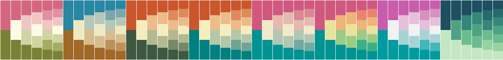

# Dicopal

**Di**screte **co**lor **pal**ettes (*hundreds of them!*) for JavaScript.




> Dicopal offers color palettes from:
> - [Colorbrewer2](https://colorbrewer2.org/)
> - [Fabio Crameri's Scientific Colour Maps](https://www.fabiocrameri.ch/colourmaps/)
> - [CARTOColors](https://carto.com/carto-colors/)
> - [cmocean](https://matplotlib.org/cmocean/)
> - [Light & Bartlein](https://agupubs.onlinelibrary.wiley.com/doi/abs/10.1029/2004EO400002)
> - [Matplotlib](https://bids.github.io/colormap/)
> - [MyCarta](https://mycartablog.com/color-palettes/)
> - [Tableau](https://help.tableau.com/current/pro/desktop/en-us/formatting_create_custom_colors.htm#hex-values-for-discontinued-color-palettes)
> - [The Wes Anderson Palettes blog](https://wesandersonpalettes.tumblr.com/)
> - [Masataka Okabe and Kei Ito's Color Universal Design (CUD) palette](https://jfly.uni-koeln.de/color/)

## Installation

### NPM

Add the package to your project:

```bash
npm install dicopal
```

### CDN

Add the script to your HTML:

```html
<script src="https://unpkg.com/dicopal"></script>
```

## Usage

### Get a palette, by name and number of colors

```javascript
const pal = getPalette('Pastel', 4); // Returns the "Pastel" palette with 4 colors
// {
//   "number": 4,
//   "type": "qualitative",
//   "name": "Pastel",
//   "id": "Pastel_4",
//   "colors": ["#66C5CC","#F6CF71","#F89C74","#DCB0F2"],
//   "provider": "cartocolors",
//   "url": "https://github.com/CartoDB/CartoColor/wiki/CARTOColor-Scheme-Names"
// }
```

### Get a palette colors, by name and number of colors

```javascript
const cols = getColors('Pastel', 4); // Returns the "Pastel" palette with 4 colors
// ["#66C5CC","#F6CF71","#F89C74","#DCB0F2"]
```

Colors can also be reversed:

```javascript
const cols = getColors('Pastel', 4, true); // Returns the "Pastel" palette with 4 colors, reversed
// ['#DCB0F2', '#F89C74', '#F6CF71', '#66C5CC']
```

### List the existing palettes for a given number of colors

```javascript
const palettes = getPalettes({ number: 3 }); // Returns 135 instances of palette
```

### List the existing palettes for a given type (sequential, diverging, qualitative)

```javascript
const palettes = getPalettes({ type: 'qualitative' }); // Returns 159 instances of qualitative palettes
```

### List the existing palettes for a given provider (ColorBrewer, Tableau, etc.)

```javascript
const palettes = getPalettes({ provider: 'colorbrewer' }); // Returns 265 instances of colorbrewer palettes
```

### List the existing palettes for a given name (for example, 'Accent')

```javascript
const palettes = getPalettes({ name: 'Accent' }); // Returns the 6 instances of the "Accent" palette
```

### List the existing palettes that match a set of criteria

```javascript
const palettes = getPalettes({ type: 'qualitative', number: 10 }); // Returns the 12 instances of the palettes that are qualitative and have 10 colors
```

### All the palettes or more criteria

When no argument is provided, the `getPalettes` function returns all the palettes:

```javascript
const allPalettes = getPalettes(); // Returns the 1600 instances of palettes
```

You can then filter the palettes yourself by any combination of criteria:

```javascript
// Only sequential and diverging palettes from all providers except colorbrewer
// with between 3 and 12 colors
const palettes = allPalettes
  .filter((p) => (
    ['sequential', 'diverging'].includes(p.type)
    && p.provider !== 'colorbrewer'
    && p.number >= 3
    && p.number <= 12)
  );
```

### List the existing providers

```javascript
const providers = getPaletteProviders(); // Returns the 10 providers
```

### List the existing types

```javascript
const providers = getPaletteTypes(); // Returns the 3 types
```

### List the existing palette names

```javascript
const providers = getPaletteNames(); // Returns the 178 names ('ArmyRose', 'BrBg', 'Accent', etc.)
```

## Other information

Palette information is stored in the `src/palette.json` file.
It is generated in Python from various sources,
notably the [palettable](https://github.com/jiffyclub/palettable)
Python library (authored by [Matt Davis](https://github.com/jiffyclub))
and the [dicopal](https://lig-tdcge.imag.fr/steamer/dicopal/index.html) RDF vocabulary which
both provide a list of palettes with their colors and metadata.

## License

Apache-2.0. See [LICENSE](./LICENSE) for details.